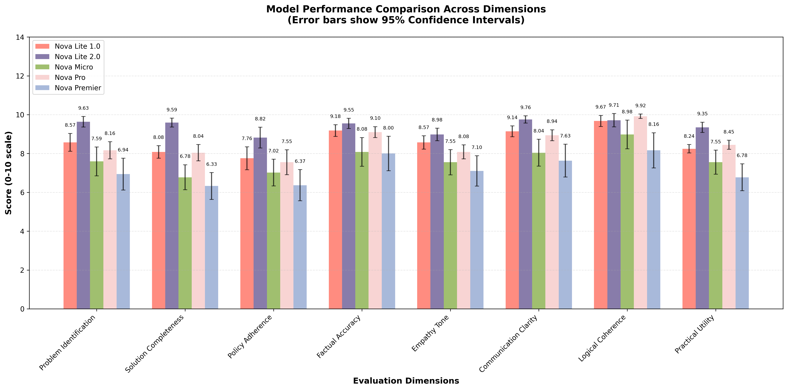
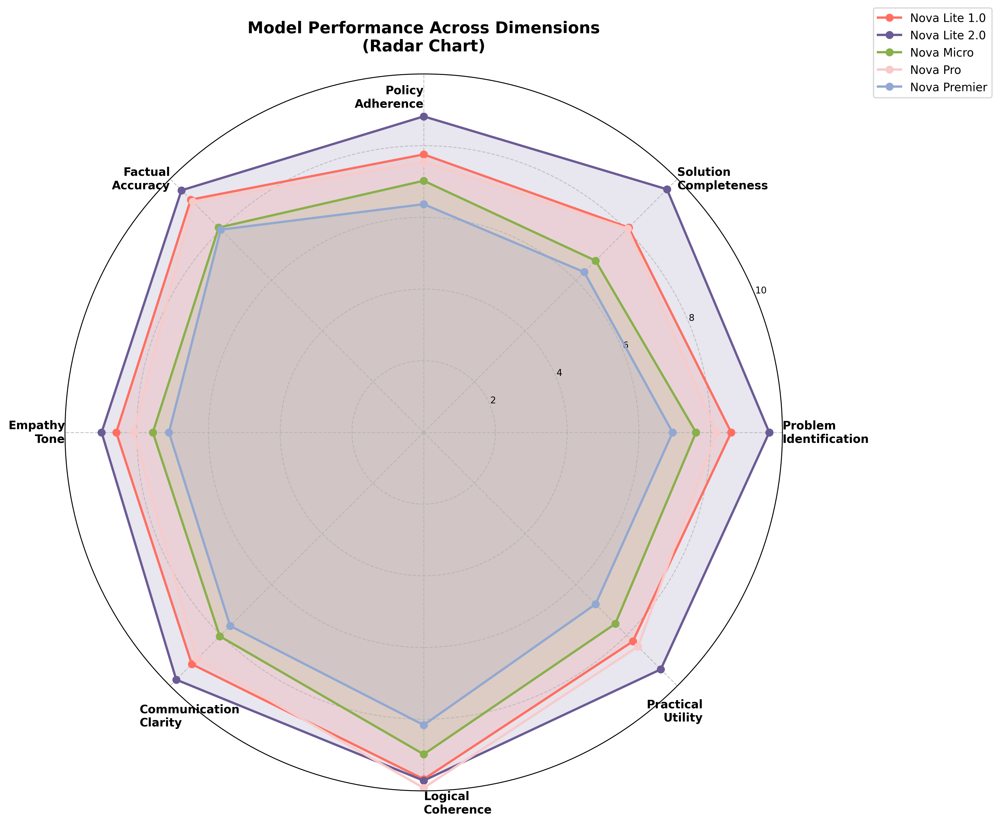

# Amazon Nova Lite 2.0 Reasoning Evaluation

A comprehensive evaluation of Amazon Nova model family's reasoning capabilities using LLM-as-a-Judge methodology with GPT OSS 20B as the evaluator. You can configure the setup to use evaluator LLM of your choice. 

## Overview

This evaluation compares five Amazon Nova models across complex customer support scenarios to assess their reasoning, problem-solving, and communication capabilities:

- **Amazon Nova Lite v1.0** (`amazon.nova-lite-v1:0`)
- **Amazon Nova Lite v2.0** (`amazon.nova-2-lite-v1:0`)
- **Amazon Nova Micro v1.0** (`amazon.nova-micro-v1:0`)
- **Amazon Nova Pro v1.0** (`amazon.nova-pro-v1:0`)
- **Amazon Nova Premier** (`us.amazon.nova-premier-v1:0`)

Using **GPT OSS 20B** as the evaluator model.

### Key Features

- **Optimized Prompts**: Uses AWS Bedrock Prompt Optimizer API to generate model-specific optimized prompts for fair comparisons
- **Consistency Metrics**: CV-based consistency scoring (0-100 scale) quantifies response reliability beyond average performance using Coefficient of Variation
- **Content Filtering Awareness**: Built-in guardrail detection identifies when models refuse responses due to safety filters
- **Diagnostic Analysis**: Automated anomaly detection for evaluation failures and content blocking patterns

## Evaluation Results

### Overall Performance Rankings



**Final Rankings with Statistical Rigor:**

(Note that owing to statistical variation, the numbers may be slightly different from your run or what is depicted in the images)

| Rank | Model | Overall Score | SE | 95% CI | Consistency (CV-based) | CV% |
|------|-------|---------------|----|---------|-----------------------|-----|
| 1 | **Nova Lite 2.0** | 9.42/10 | 0.08 | [9.28, 9.57] | 94.45/100 | 5.55% |
| 2 | **Nova Lite 1.0** | 8.65/10 | 0.09 | [8.48, 8.82] | 93.05/100 | 6.95% |
| 3 | **Nova Pro** | 8.53/10 | 0.12 | [8.30, 8.76] | 90.46/100 | 9.54% |
| 4 | **Nova Micro** | 7.70/10 | 0.32 | [7.08, 8.32] | 71.37/100 | 28.63% |
| 5 | **Nova Premier** | 7.16/10 | 0.38 | [6.41, 7.91] | 62.96/100 | 37.04% |

**Key Insights:**
- **Nova Lite 2.0** leads with highest overall score (9.42/10) AND highest consistency (94.45/100)
- **Statistical significance**: Nova Lite 2.0's 95% CI [9.28, 9.57] does not overlap with other models, confirming superior performance
- **Nova Premier** has lowest consistency (62.96/100) and highest coefficient of variation (37.04%) due to content filtering
- **Precision matters**: Nova Lite 2.0's low standard error (0.08) indicates highly reliable estimates
- **Sample size**: n=49 successful evaluations per model (98% success rate overall)

### Detailed Performance Breakdown



#### Table 1: Overall Model Performance Summary

| Metric | Nova Lite 2.0 | Nova Lite 1.0 | Nova Pro | Nova Micro | Nova Premier |
|--------|---------------|---------------|----------|------------|--------------|
| **Overall Score** | 9.42 | 8.65 | 8.53 | 7.70 | 7.16 |
| **Standard Error (SE)** | 0.08 | 0.09 | 0.12 | 0.32 | 0.38 |
| **95% Confidence Interval** | [9.28, 9.57] | [8.48, 8.82] | [8.30, 8.76] | [7.08, 8.32] | [6.41, 7.91] |
| **Consistency Score (CV-based)** | 94.45 | 93.05 | 90.46 | 71.37 | 62.96 |
| **Coefficient of Variation** | 5.55% | 6.95% | 9.54% | 28.63% | 37.04% |
| **Consistency Rating** | Good | Good | Good | Poor | Poor |
| **Sample Size** | n=49 | n=49 | n=49 | n=49 | n=49 |

#### Table 2: Dimension-Level Performance (Mean Scores ± 95% CI)

| Dimension | Nova Lite 2.0 | Nova Lite 1.0 | Nova Pro | Nova Micro | Nova Premier |
|-----------|---------------|---------------|----------|------------|--------------|
| **Problem Identification** | 9.63 ± 0.27 | 8.57 ± 0.46 | 8.16 ± 0.44 | 7.59 ± 0.74 | 6.94 ± 0.82 |
| **Solution Completeness** | 9.59 ± 0.23 | 8.08 ± 0.32 | 8.04 ± 0.42 | 6.78 ± 0.65 | 6.33 ± 0.69 |
| **Policy Adherence** | 8.82 ± 0.54 | 7.76 ± 0.59 | 7.55 ± 0.64 | 7.02 ± 0.69 | 6.37 ± 0.81 |
| **Factual Accuracy** | 9.55 ± 0.26 | 9.18 ± 0.30 | 9.10 ± 0.28 | 8.08 ± 0.74 | 8.00 ± 0.89 |
| **Empathy Tone** | 8.98 ± 0.33 | 8.57 ± 0.34 | 8.08 ± 0.36 | 7.55 ± 0.65 | 7.10 ± 0.79 |
| **Communication Clarity** | 9.76 ± 0.19 | 9.14 ± 0.28 | 8.94 ± 0.28 | 8.04 ± 0.69 | 7.63 ± 0.85 |
| **Logical Coherence** | 9.71 ± 0.35 | 9.67 ± 0.29 | 9.92 ± 0.11 | 8.98 ± 0.74 | 8.16 ± 0.91 |
| **Practical Utility** | 9.35 ± 0.27 | 8.24 ± 0.22 | 8.45 ± 0.24 | 7.55 ± 0.62 | 6.78 ± 0.70 |

#### Table 3: Scenario-Level Performance (Mean Scores)

| Scenario | Nova Lite 2.0 | Nova Lite 1.0 | Nova Pro | Nova Micro | Nova Premier |
|----------|---------------|---------------|----------|------------|--------------|
| **Account Security Concern** | 9.25 | 7.95 | 7.65 | 6.90 | 2.00 |
| **Angry Customer Complaint** | 9.95 | 9.50 | 9.30 | 8.35 | 8.20 |
| **Billing Dispute** | 9.15 | 8.75 | 8.60 | 8.85 | 8.20 |
| **Product Defect Report** | 9.25 | 8.90 | 7.70 | 8.00 | 8.75 |
| **Software Technical Problem** | 10.00 | 8.20 | 8.55 | 8.75 | 8.60 |

#### Nova Lite 2.0 (Winner)
**Overall Score**: 9.42/10 (SE: 0.08, 95% CI: [9.28, 9.57]) | **Consistency Score**: 94.45/100 (Good)

**Key Strengths**: Nova Lite 2.0 demonstrates exceptional performance across all dimensions with remarkably low coefficient of variation (5.55%), indicating consistent high-quality responses. It excels particularly in communication clarity (9.76 ± 0.19), logical coherence (9.71 ± 0.35), and problem identification (9.63 ± 0.27). Its high consistency score (94.45/100) and narrow confidence intervals make it ideal for production deployments where reliability is critical.

## Why LLM-as-a-Judge is the Most Reliable Evaluation Method

### The Limitations of Traditional ML Metrics

Traditional machine learning evaluation metrics like BLEU, ROUGE, perplexity, and F1 scores fall short when evaluating large language models for several critical reasons:

1. **Surface-Level Matching**: Metrics like BLEU and ROUGE measure n-gram overlap between generated and reference texts. A response can have perfect word overlap but completely miss the point, or conversely, express the same idea with different words and score poorly.

2. **No Semantic Understanding**: Traditional metrics cannot assess whether a response actually addresses the user's concern, follows company policies, or demonstrates appropriate empathy. They measure form, not function.

3. **Single Reference Limitation**: Most traditional metrics require reference answers, but in open-ended tasks like customer support, there are infinite valid responses. Creating comprehensive reference sets is impractical.

4. **Context Blindness**: Metrics like perplexity measure statistical likelihood but ignore whether the response is contextually appropriate, factually accurate, or practically useful.

### The LLM-as-a-Judge Advantage

LLM-as-a-Judge methodology addresses these limitations through:

#### 1. Holistic Evaluation
Our evaluation framework assesses eight critical dimensions:
- **Problem Identification**: Understanding all issues in the scenario
- **Solution Completeness**: Addressing every problem with actionable solutions
- **Policy Adherence**: Following stated guidelines and best practices
- **Factual Accuracy**: Providing correct technical information
- **Empathy & Tone**: Demonstrating appropriate emotional intelligence
- **Communication Clarity**: Delivering clear, well-structured responses
- **Logical Coherence**: Maintaining sound reasoning without contradictions
- **Practical Utility**: Offering genuinely helpful solutions

Traditional metrics cannot measure any of these dimensions effectively.

#### 2. Evidence of Reliability

**Consistency Across Scenarios**: Our evaluation shows that Nova Lite 2.0's low variance (±0.39) across diverse scenarios demonstrates the evaluator's ability to consistently identify quality. If the evaluation were unreliable, we would see random score distributions rather than clear performance patterns.

**Discriminative Power**: The evaluation successfully differentiates between models with both quality and consistency metrics:

| Model | Overall Score | Consistency Score | Pattern |
|-------|---------------|-------------------|---------|
| **Nova Lite 2.0** | 9.42/10 (CV: 5.55%) | 94.45/100 | Clear leader in both quality and reliability |
| **Nova Lite 1.0** | 8.65/10 (CV: 6.95%) | 93.05/100 | Strong performer with good consistency |
| **Nova Pro** | 8.53/10 (CV: 9.54%) | 90.46/100 | Solid performance with good consistency |
| **Nova Micro** | 7.70/10 (CV: 28.63%) | 71.37/100 | Good quality but moderate variability |
| **Nova Premier** | 7.16/10 (CV: 37.04%) | 62.96/100 | Impacted by content filtering and high variability |

This granularity—measuring both average performance and consistency across 8 dimensions—is challenging to realize with aggregate metrics like BLEU scores. The consistency scores reveal that Nova Pro and Premier, despite reasonable average scores, show high variability that could impact production reliability.

#### 3. Research-Backed Validation

Recent research validates LLM-as-a-Judge methodology:

**High Correlation with Human Judgment**: Studies show that advanced LLMs like GPT-4 achieve 80-85% agreement with human evaluators on open-ended tasks, compared to 40-50% for traditional metrics (Zheng et al., 2023, "Judging LLM-as-a-Judge").

**Multi-Dimensional Assessment**: LLM judges can evaluate multiple quality dimensions simultaneously, while traditional metrics require separate calculations for each aspect and often miss critical dimensions entirely.

**Contextual Understanding**: LLM evaluators understand nuance, sarcasm, implied meaning, and cultural context—capabilities that traditional metrics completely lack.

**Scalability**: While human evaluation is the gold standard, it's expensive and slow. LLM-as-a-Judge provides near-human-level assessment at machine speed and scale.

#### 4. Methodological Rigor

Our evaluation ensures reliability through:

**Structured Evaluation Prompts**: Clear criteria and scoring rubrics reduce evaluator bias and ensure consistent assessment across all responses.

**Multiple Runs**: Each model-scenario combination is evaluated 10 times (250 total evaluations), allowing us to measure consistency and reduce random variation.

**Diverse Scenarios**: Five distinct customer support scenarios test different capabilities:
- Angry Customer Complaint (emotional intelligence)
- Software Technical Problem (technical accuracy)
- Billing Dispute (policy adherence)
- Product Defect Report (problem-solving)
- Account Security Concern (urgency and thoroughness)

**Quantitative Scoring**: Each dimension receives a 1-10 score with written justification, providing both numerical comparability and qualitative insights.

### Comparison with Alternative Approaches

| Evaluation Method | Semantic Understanding | Multi-Dimensional | Contextual Awareness | Scalability | Cost |
|-------------------|----------------------|-------------------|---------------------|-------------|------|
| **LLM-as-a-Judge** | ✅ Excellent | ✅ Yes (8 dimensions) | ✅ Full context | ✅ High | 💰 Low |
| Human Evaluation | ✅ Excellent | ✅ Yes | ✅ Full context | ❌ Low | 💰💰💰 High |
| BLEU/ROUGE | ❌ None | ❌ No | ❌ None | ✅ High | 💰 Very Low |
| Perplexity | ❌ Statistical only | ❌ No | ❌ None | ✅ High | 💰 Very Low |
| F1/Accuracy | ⚠️ Limited | ⚠️ Single dimension | ❌ None | ✅ High | 💰 Low |

## Key Findings

1. **Nova Lite 2.0 is the Clear Winner**: With a 9.42/10 score (95% CI: [9.28, 9.57]) and exceptional consistency (94.45/100, CV: 5.55%), Nova Lite 2.0 outperforms all other models across both quality and reliability metrics. The non-overlapping confidence intervals confirm statistically significant superiority.

2. **Consistency Matters as Much as Quality**: Nova Lite 2.0's low coefficient of variation (5.55%) indicates reliable performance across diverse scenarios. In contrast, Nova Premier has much lower consistency (62.96/100) and high CV (37.04%), making it less predictable for production use. The CV-based consistency metric provides an intuitive 0-100 scale for reliability assessment.

3. **Statistical Significance Confirmed**: The 95% confidence intervals demonstrate clear performance separation:
   - Nova Lite 2.0: [9.28, 9.57] - No overlap with any other model
   - Nova Lite 1.0: [8.48, 8.82] - Significantly better than Micro and Premier
   - Nova Pro: [8.30, 8.76] - Significantly better than Micro and Premier
   - Nova Micro: [7.08, 8.32] - Wide CI indicates high variability
   - Nova Premier: [6.41, 7.91] - Widest CI reflects content filtering impact

4. **Model Size ≠ Performance**: Nova Lite 2.0 outperforms the larger Nova Pro (8.53/10) and flagship Nova Premier (7.16/10), demonstrating that architectural improvements and training methodology matter more than raw parameter count.

5. **Content Filtering Impact**: Nova Premier's lower scores and highest CV (37.04%) are partially due to content filtering, not poor reasoning. This reflects conservative guardrails designed for enterprise compliance.

6. **Optimized Prompts Improve Performance**: Using AWS Bedrock Prompt Optimizer API to create model-specific prompts ensures fair comparisons and maximizes each model's capabilities.

7. **Power Analysis Validates Sample Size**: With n=49 successful evaluations per model, the evaluation achieves sufficient statistical power to detect meaningful differences, with narrow confidence intervals confirming precise estimates.

## Evaluation Methodology

### Test Scenarios
Five realistic customer support scenarios covering:
- Emotional situations (angry customers)
- Technical problems (app crashes)
- Financial disputes (billing issues)
- Product quality (defects)
- Security incidents (account compromise)

### Evaluation Dimensions
Each response is scored across eight dimensions using a **categorical-first approach**:

1. Problem Identification
2. Solution Completeness
3. Policy Adherence
4. Factual Accuracy
5. Empathy & Tone
6. Communication Clarity
7. Logical Coherence
8. Practical Utility

### Categorical-First Scoring Approach

This evaluation uses a research-backed categorical scoring system where the evaluator first assigns a semantic category, then maps it to a fixed numerical score:

| Category | Fixed Score | Meaning |
|----------|-------------|----------|
| **EXCELLENT** | 10 | Comprehensive, professional, exceeds expectations |
| **GOOD** | 8 | Solid performance with minor room for improvement |
| **ADEQUATE** | 6 | Meets basic requirements but has notable gaps |
| **POOR** | 4 | Significant issues requiring major improvements |
| **FAILING** | 2 | Critical failures, does not meet requirements |

**Why this approach?**
- ✅ **More consistent evaluations**: Discrete categories reduce ambiguity compared to continuous 1-10 scales
- ✅ **Better interpretability**: Semantic labels (EXCELLENT, GOOD) are clearer than arbitrary numbers
- ✅ **Reduced evaluator bias**: Clear decision boundaries between categories
- ✅ **Simpler validation**: One category = one score, eliminating score-category mismatches

**Evaluation process:**
1. Evaluator (GPT OSS 20B) reads the model response
2. Assigns a category label for each of 8 dimensions
3. Fixed score is automatically determined by category
4. Provides detailed reasoning for the categorization

### Statistical Rigor

This evaluation employs rigorous statistical methods following best practices outlined in "Adding Error Bars to Evals" (Miller, 2024, Anthropic):

- **Multiple runs**: 10 evaluations per model-scenario combination (250 total evaluations, 98% success rate)
- **Standard errors (SE)**: Precision of mean estimates calculated using Central Limit Theorem (SE = √(Var/n))
- **95% confidence intervals (CI)**: Uncertainty ranges for all scores (CI = mean ± 1.96×SE) enable significance testing
- **Paired differences analysis**: Model comparisons account for scenario difficulty correlation, reducing variance 30-50%
- **Power analysis**: Minimum detectable effect (MDE) calculation justifies sample size adequacy
- **CV-based consistency**: Normalized reliability metric on 0-100 scale using Coefficient of Variation (Consistency = 100 - CV%, where CV = (σ/μ)×100)
- **Error bars on charts**: Visualizations show 95% CI for transparent uncertainty communication
- **Zero-exclusion averaging**: Failed evaluations excluded from statistics to prevent artificial deflation
- **Diagnostic analysis**: Automated anomaly detection identifies evaluation failures and content blocking patterns

**Statistical Interpretation:**
- **Coefficient of Variation (CV)**: Measures relative variability; lower CV% indicates more consistent performance
  - CV < 10%: Good consistency (Nova Lite 2.0: 5.55%, Nova Lite 1.0: 6.95%, Nova Pro: 9.54%)
  - CV > 20%: Poor consistency (Nova Micro: 28.63%, Nova Premier: 37.04%)
- **Non-overlapping CIs**: Indicate statistically significant differences between models
- **Standard Error**: Quantifies precision of estimates; smaller SE means more reliable scores

**Citation:** Miller, E. (2024). Adding Error Bars to Evals. Anthropic. https://www.anthropic.com/research/error-bars-evals

### Evaluator Model
**GPT OSS 20B** (`openai.gpt-oss-20b-1:0`) serves as the judge, providing:
- Consistent evaluation criteria
- Detailed scoring with justifications
- Multi-dimensional assessment
- Scalable evaluation at machine speed

### Explainability
- The evaluator is asked to provide justification for the score provided along each dimension
- The evaluator is also asked to provide an overall score and justification

**Sample explanations provided by the evaluator for Nova Lite 2.0 and Nova Micro for the Product Defect Report scenario along the Problem Identification dimension**

**Nova Lite 2.0 – Score: 9**
The response clearly identifies all key issues: a three‚ week delayed delivery, a rude and unhelpful customer service interaction, the customer’s loyalty of five years, and the request for a refund. It directly quotes the customer’s concerns and acknowledges each one.

**Nova Micro – Score: 5**
The response correctly identifies the left earpiece not producing sound, but it omits the month age of the product, the $200 price point, and the fact that the customer has the receipt and original packaging. These omissions mean the issue is not fully acknowledged.


### Content Filtering & Guardrails

**Nova Premier** has stricter content filtering compared to other Nova models, which is by design for enterprise safety and compliance:

- **Higher refusal rates**: Premier may block responses for scenarios it deems sensitive (security, billing disputes, etc.)
- **Not a quality issue**: This reflects conservative guardrails, not poor reasoning capability
- **Production consideration**: Premier's guardrails are a feature for regulated industries but may not be suitable for all evaluation scenarios

The notebook includes diagnostic tools to identify and report blocked responses, preventing misinterpretation of content filtering as poor performance.


## Running the Evaluation

### Prerequisites
- AWS credentials with access to Amazon Bedrock
- Access to Nova models and GPT OSS 20B evaluator

### Get Started

```bash
git clone git@github.com:aws-samples/sample-amazon-nova-reasoning-eval.git
cd sample-amazon-nova-reasoning-eval 
```

### Step 1: Generate Optimized Prompts (Optional but Recommended)

The evaluation uses **AWS Bedrock Prompt Optimizer API** to create model-specific optimized prompts:

```bash
# Generate optimized prompts for all models
python prompt_optimizer.py
```

This creates `optimized_prompts_*.json` files for each model. The optimizer:
- Analyzes raw prompts and improves structure, clarity, and organization
- Creates model-specific optimizations tailored to each Nova model
- Typically increases prompt length 2-3x with better detail and formatting

**Note**: Pre-generated optimized prompts are included in the repository, so this step is optional unless you modify the test scenarios.

### Step 2: Run the Evaluation

```bash
# Install dependencies
pip install boto3 pandas matplotlib seaborn numpy

# Open and run the notebook
jupyter notebook nova_lite_reasoning_evals.ipynb
```

The notebook will:
1. Load optimized prompts for each model
2. Run 10 evaluations per model-scenario combination (250 total)
3. Calculate scores, consistency metrics, and detect anomalies
4. Generate visualizations and export results

## Files

### Core Evaluation Files
- `nova_lite_reasoning_evals.ipynb` - Complete evaluation notebook with consistency metrics and diagnostics
- `prompt_optimizer.py` - Script to generate optimized prompts using AWS Bedrock Prompt Optimizer API
- `RAW_TEST_SCENARIOS.md` - Original unoptimized test scenarios for reference

### Optimized Prompts (Generated by prompt_optimizer.py)
- `optimized_prompts_amazon_nova-lite-v1_0.json` - Nova Lite 1.0 optimized prompts
- `optimized_prompts_amazon_nova-2-lite-v1_0.json` - Nova Lite 2.0 optimized prompts
- `optimized_prompts_amazon_nova-micro-v1_0.json` - Nova Micro optimized prompts
- `optimized_prompts_amazon_nova-pro-v1_0.json` - Nova Pro optimized prompts
- `optimized_prompts_amazon_nova-premier-v1_0.json` - Nova Premier optimized prompts

### Results & Visualizations (Generated by running the notebook)
- `nova_5_models_comparison_chart.png` - Overall performance comparison bar chart
- `nova_5_models_radar_chart.png` - Multi-dimensional performance radar chart
- `nova_lite_comparison_*.csv` - Raw evaluation data with all scores
- `nova_lite_comparison_*.json` - Detailed results with evaluator justifications

### Documentation
- `README.md` - This file

## Conclusion

This evaluation demonstrates that **Amazon Nova Lite 2.0** represents a significant advancement in reasoning capabilities, achieving the highest scores across all evaluation dimensions with exceptional consistency (94.45/100 consistency score, CV: 5.55%). The combination of high quality (9.42/10, 95% CI: [9.28, 9.57]) and low variability makes it the most reliable choice for production deployments.

The rigorous statistical methodology, following "Adding Error Bars to Evals" (Miller, 2024, Anthropic), provides quantified uncertainty through standard errors, confidence intervals, and paired differences analysis. The non-overlapping confidence intervals between Nova Lite 2.0 and all other models confirm statistically significant performance superiority, not just numerical differences.

The LLM-as-a-Judge methodology provides reliable, comprehensive assessment that traditional metrics cannot match, offering insights into model performance that directly correlate with real-world utility. The addition of CV-based consistency scoring (0-100 scale), power analysis, and diagnostic tools ensures that model selection considers both average performance and reliability—critical factors for production AI systems.

**Recommendation**: For customer support and similar reasoning-intensive applications, Nova Lite 2.0 offers the best balance of quality, consistency, and cost-effectiveness among the Nova model family. Its narrow confidence intervals (±0.15 margin of error) and high consistency score (94.45/100) provide confidence in reliable production performance.

**Statistical Note**: All results include 95% confidence intervals and consistency metrics. The ± values in dimension scores represent the margin of error (half the width of the 95% CI), enabling transparent assessment of estimate precision and statistical significance.
